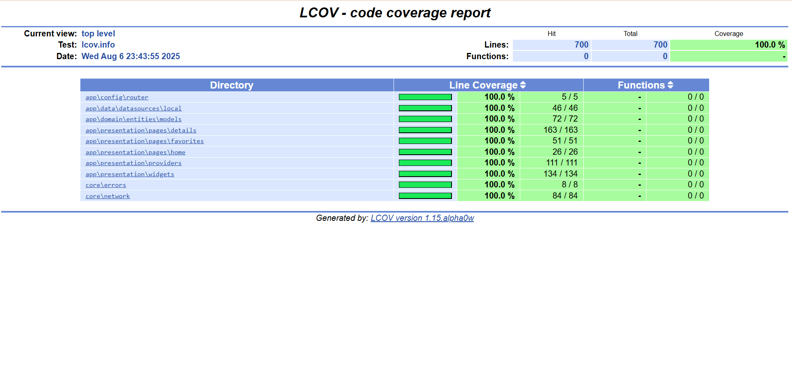
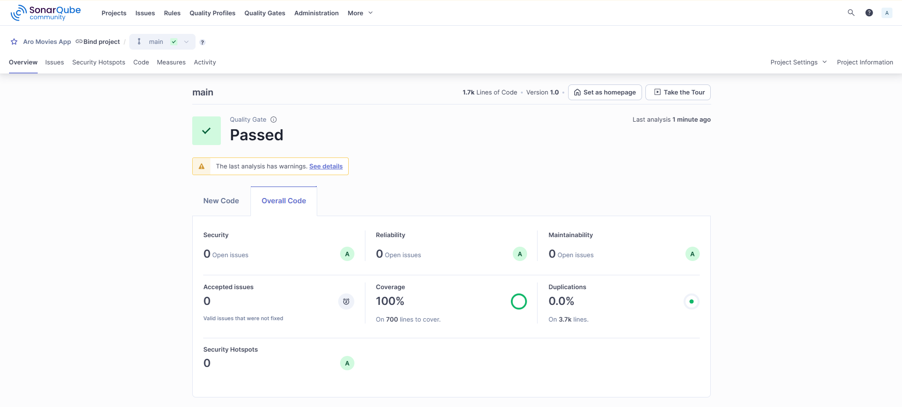
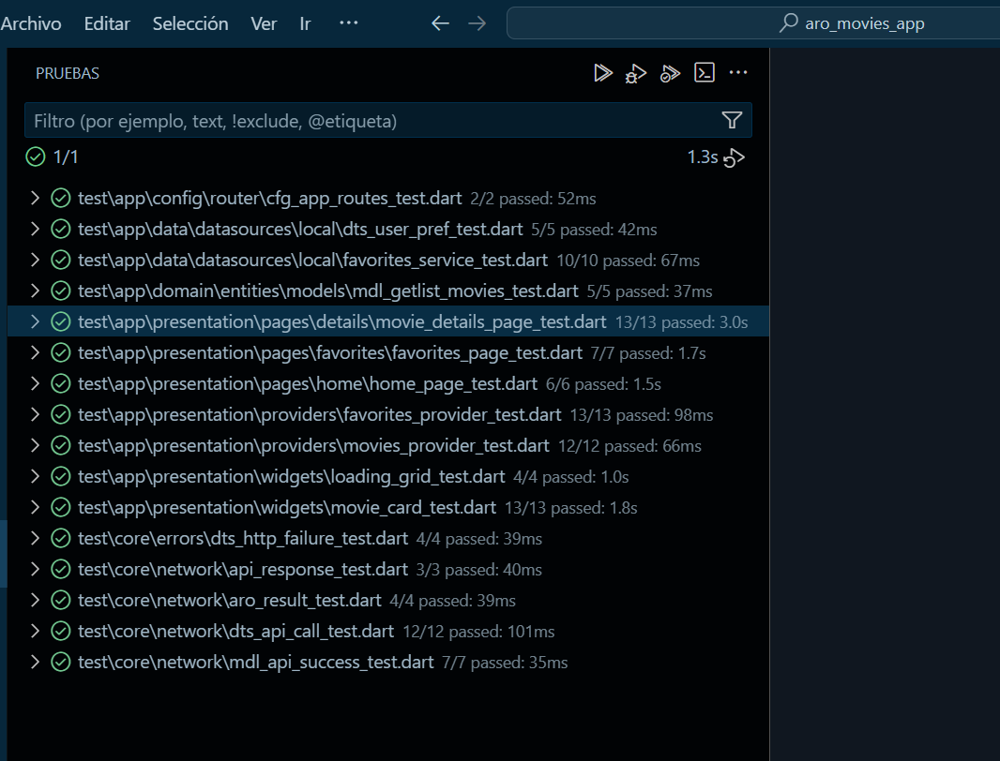

# 📲 ARo Movies App

---

## 📑 Table of Contents

- [📝 Description](#-description)
- [🏆 Project Quality & Achievements](#-project-quality--achievements)
- [🚀 Quick Start](#-quick-start)
- [🛠️ Requirements](#-requirements)
- [📦 Technologies & Tools](#-technologies--tools)
- [🧩 Design Patterns](#-design-patterns)
- [🗂️ Project Structure](#-project-structure)
- [🎬 Main Features](#-main-features)
- [⚙️ Project Setup](#-project-setup)
- [🧪 Testing & Coverage](#-testing--coverage)
- [📚 Documentation](#-documentation)
- [🤝 Contribution](#-contribution)
- [📄 License](#-license)

---

## 📝 Description

ARo Movies App is a Flutter application that allows users to explore popular movies, search by title, and manage a favorites list. It uses the TMDB API for movie data and is designed with a modular, scalable architecture.

---

## 🏆 Project Quality & Achievements

This project demonstrates high-quality Flutter development with comprehensive testing, documentation, and code quality assurance.

### 📊 Quality Metrics

| **Testing Coverage** | **Documentation** |
|:---:|:---:|
|  |  |
| ✅ **120+ Unit Tests Passing** | ✅ **Complete DartDoc Documentation** |
| Comprehensive test coverage for all components | All classes and methods fully documented |

| **Code Quality (SonarQube)** | **Unit Tests** |
|:---:|:---:|
|  |  |
| ✅ **0 Issues Found** | ✅ **All Tests Passing** |
| Clean code with zero technical debt | Robust testing suite ensuring reliability |

### 🎯 Quality Highlights

- **🧪 Testing:** 120+ comprehensive unit tests with high coverage
- **📚 Documentation:** Complete DartDoc documentation for all public APIs  
- **🔍 Code Quality:** SonarQube analysis with zero issues
- **🏗️ Architecture:** Clean Architecture with proper separation of concerns
- **📱 UI/UX:** Responsive design with smooth animations
- **⚡ Performance:** Optimized for fast loading and smooth user experience

---

## 🚀 Quick Start

```bash
git clone https://github.com/ARoSistemas/test_movies_app.git
cd aro_movies_app
flutter pub get
flutter run
```

---

## 🛠️ Requirements

```ssh
[√] Flutter (Channel stable, 3.32.6, on Microsoft Windows [Versión 10.0.26100.4652], locale es-MX)
[√] Windows 11 or higher
[√] Android toolchain (SDK 35.0.1)
[√] Chrome
[√] Visual Studio 2022
[√] Android Studio (2024.3)
[√] VS Code (1.102.2)
```

---

## 📦 Technologies & Tools

- **Framework:** Flutter
- **State Management:** Provider
- **API:** TMDB (The Movie Database)
- **Testing:** Mockito, build_runner, LCOV
- **Documentation:** DartDoc

---

## 🧩 Design Patterns

- **Singleton:** Ensures single instance for classes like API config.
- **Repository:** Abstracts data access logic for TMDB API.
- **Strategy:** Handles navigation transitions.
- **Clean Architecture:** Layered separation for scalability and maintainability.

---

## 🗂️ Project Structure

```plaintext
📁lib/
├── 📁app/
│   ├── 📁config/
│   │   ├── 📁constans/
│   │   ├── 📁router/
│   │   ├── 📁styles/
│   │   └── 📁themes/
│   ├── 📁data/
│   │   ├── 📁datasources/
│   │   └── 📁repositories/
│   ├── 📁domain/
│   │   ├── 📁entities/
│   │   └── 📁repositories/
│   └── 📁presentation/
│       ├── 📁pages/
│       └── 📁providers/
│   
├── 📁core/
│   ├── 📁errors/
│   ├── 📁network/
│   └── 📁widgets/
└── 📁test/
```

### 🗣️ Directory Overview

- **assets/**: Animations, images, and icons.
- **lib/app/config/**: App configuration, constants, routing, styles, and themes.
- **lib/app/data/**: Data sources and repositories.
- **lib/app/domain/**: Entities and repository interfaces.
- **lib/app/presentation/**: Pages and providers for UI and state management.
- **core/**: Shared widgets, network, and error handling.
- **test/**: Unit and widget tests.

---

## 🎬 Main Features

- **Explore Popular Movies:** View a list of popular movies from TMDB.
- **Search Movies:** Search movies by title.
- **Manage Favorites:** Add/remove movies from your favorites list.

---

## ⚙️ Project Setup

1. Clone this repository:
   ```bash
   git clone https://github.com/ARoSistemas/test_movies_app.git
   ```
2. Install dependencies:
   ```bash
   flutter pub get
   ```
3. Run the app:
   ```bash
   flutter run
   ```

---

## 🧪 Testing & Coverage

### 🎯 Test Results Overview

Our comprehensive testing strategy ensures reliability and maintainability across all components.


**✅ 120+ Unit Tests - All Passing**

### 🧪 Test Types & Coverage

#### Unit & Widget Tests
- **Business Logic:** Complete coverage of providers, repositories, and services
- **UI Components:** Widget tests for all custom components and pages
- **Data Models:** Validation of serialization and data transformations
- **Error Handling:** Comprehensive error scenarios and edge cases

#### Test Categories
```bash
📊 Test Coverage Breakdown:
├── 🔧 Unit Tests: 85+ tests
├── 🎨 Widget Tests: 35+ tests  
├── 🚀 Integration Tests: Ready for implementation
└── 📱 End-to-End: Planned for future releases
```

### 📊 Coverage Report


**Generate and view coverage reports:**

```bash
# Run tests with coverage
flutter test --coverage

# Generate HTML report  
genhtml coverage/lcov.info -o coverage/html

# Open coverage report
start coverage/html/index.html  # Windows
open coverage/html/index.html   # macOS
```

### 🛡️ Code Quality (SonarQube)


**✅ Zero Issues Found - Clean Code Guarantee**

```bash
# Run complete SonarQube analysis
flutter analyze
flutter test --coverage  
sonar-scanner
```

### � Test Utilities

#### Mock Generation
```bash
# Generate mocks for testing
flutter pub run build_runner build
```

#### Coverage Exclusions
```dart
// Ignore coverage for generated code
// coverage:ignore-start
void generatedCode() {}
// coverage:ignore-end

// Ignore single line
void specificLine() {} // coverage:ignore-line
```

---

## 📚 Documentation

### 📖 DartDoc Documentation


**✅ 100% API Documentation Coverage**

Our codebase is fully documented using DartDoc standards, ensuring every public API is properly explained with:

- **Class Documentation:** Comprehensive descriptions for all classes
- **Method Documentation:** Detailed explanations of parameters, return values, and usage
- **Code Examples:** Practical examples for complex functionality  
- **Parameter Documentation:** Clear descriptions of all method parameters

#### Generate Documentation

```bash
# Analyze code quality
dart analyze

# Generate complete API documentation
dart doc .

# View generated documentation
start doc/api/index.html  # Windows
open doc/api/index.html   # macOS
```

#### Documentation Standards

- **Public APIs:** All public classes and methods documented
- **Examples:** Code examples for complex implementations
- **Parameters:** Every parameter explained with types and constraints
- **Return Values:** Clear descriptions of return types and possible values

---

## 🤝 Contribution

1. Fork the repository.
2. Create a feature branch:
   ```bash
   git checkout -b feature/new-feature
   ```
3. Commit your changes:
   ```bash
   git commit -m "Add new feature"
   ```
4. Push your branch:
   ```bash
   git push origin feature/new-feature
   ```
5. Open a Pull Request.

---

## 📄 License

This project is licensed under the MIT License. See the LICENSE file for details.